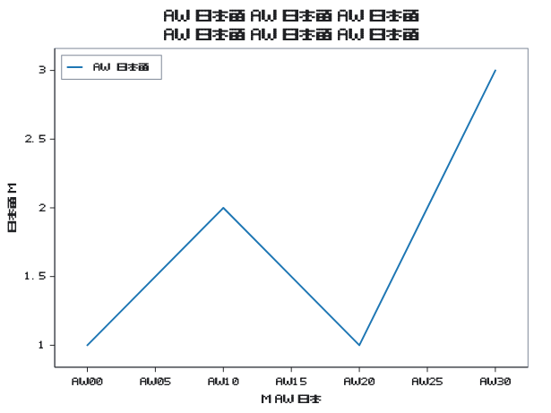
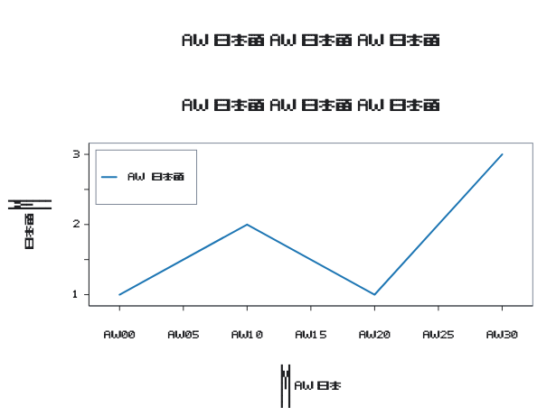

# Optional font metrics

The core `sen` package does not depend on font discovery or Kumihan. Importing
`sen_kumihan` opts into the published **mojo-kumihan==0.1.0** package. Its source
module ships inside the Sen package's normal Mojo import directory; consumers
never need a sibling checkout or an extra source path.

After the Sen version containing this adapter is released, consumers can add
`mojo-kumihan==0.1.0` to the same ecosystem-channel project. Until that release,
use the source checkout's `fonts` environment:

```sh
pixi run --locked -e fonts fonts-check
```

```mojo
from kumihan import FontFace
from sen import Plot, Theme, Typography, encode_svg, write_svg
from sen_kumihan import KumihanTextMetrics
from std.pathlib import Path


def main() raises:
    var bytes = Path("tests/fixtures/metrics.ttf").read_bytes()
    var metrics = KumihanTextMetrics(
        FontFace.from_bytes(bytes^), "Sen Metrics Fixture"
    )
    var x: List[Float64] = [0.0, 1.0]
    var y: List[Float64] = [1.0, 2.0]
    var plot = (
        Plot().with_line(x, y, label="AW 日本語")
        .with_title("AW 日本語")
        .with_theme(Theme().with_typography(
            Typography().with_family("Sen Metrics Fixture")
        ))
    )
    var plan = plot.build_render_plan(metrics)
    write_svg("output/measured.svg", encode_svg(plan))
```

Run this with `pixi run --locked -e fonts mojo run -I src my_plot.mojo`.
Supply the exact same font to the SVG viewer using `@font-face` or an installed
font. Sen measures the explicit bytes; it does not embed or license fonts on
the user's behalf. A family mismatch or any missing glyph raises an actionable
error instead of measuring an unrelated fallback.

This adapter uses **nominal cmap/hmtx horizontal advances** and disables browser
kerning and optional ligatures in the SVG. It covers simple Latin/CJK labels;
it disables default OpenType substitutions/positioning (including `locl` and
`ccmp`) and optical sizing. Use a static font and its explicit `font_weight`
(default 400), which Sen applies to every text role. It does not claim
browser-equivalent Arabic/Indic shaping, combining-mark attachment, variable-font
axes, or general OpenType positioning. Choose a complete shaping provider
for those requirements. The vertical line box uses the font's hhea ascender, descender, and line gap.
Axis/title/tick/legend anchors use those explicit baseline extents. As with any
metrics provider, those extents must cover the chosen font's ink; the adapter
measures hhea/hmtx data, not individual glyph outline bounds. Measured text
preserves repeated and edge spaces in SVG, matching the supplied text exactly.

## Reproducible visual fixture

`tests/fixtures/metrics.ttf` is an original, deliberately small Sen font fixture
under the repository's MIT OR Apache-2.0 license. It contains ASCII digits,
`A W M I`, spaces/punctuation, and `日本語`, with unequal horizontal advances and
known ascender/descender values. The default font contains a `locl` mapping
from A to a wider W; nominal-mode CSS must suppress it. A wider semibold face
catches accidental role-weight substitution, while `metrics-deep.ttf` has a
very tall/deep M glyph to expose baseline clipping. Regenerate it using:

```sh
pixi exec --spec fonttools==4.61.1 -- python scripts/generate-metrics-font.py
```

`fonts/test_kumihan_metrics.mojo` reads that file through the installed Kumihan
package. It checks exact advances, missing glyphs, long-title fitting, tick
collisions, and legend bounds, then writes the SVG and measured-width TSV.
`scripts/check-svg-browser.cjs` embeds the same font in the visual golden,
compares Chromium's actual text widths with every measured run (tolerance: max
0.06 logical units / 0.1% for CSS size serialization and browser subpixel
quantization), checks glyph
bounds inside the canvas, and verifies the exported accessibility tree. It
requires Playwright with Chromium installed and runs without page network I/O.
With Node/npm available, the reproducible optional browser setup is:

```sh
npm install --prefix .pixi/browser-qa playwright@1.62.1
node .pixi/browser-qa/node_modules/playwright/cli.js install chromium
pixi run --locked mojo run -I src examples/accessible_plot.mojo
pixi run --locked -e fonts fonts-check
NODE_PATH="$PWD/.pixi/browser-qa/node_modules" node scripts/check-svg-browser.cjs
```


The [standalone SVG golden](../tests/fixtures/metrics-layout.svg) embeds the
fixture. The PNG below was rendered from that golden after all width/bounds
checks passed.




The same browser checks also verify the [deep-extents SVG](../tests/fixtures/metrics-deep.svg):


